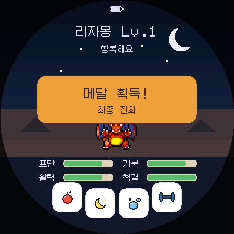
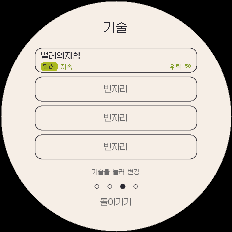
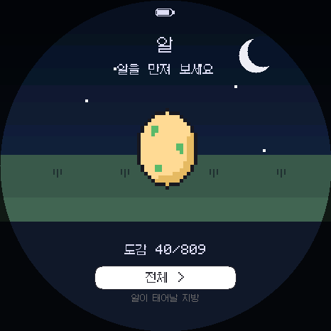
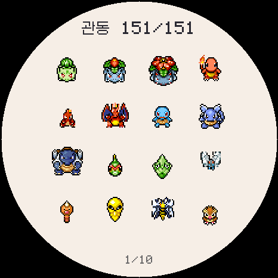
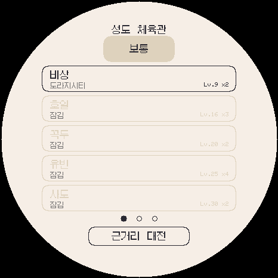
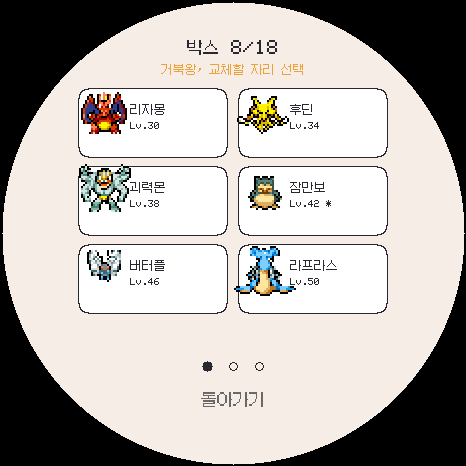

> **이 저장소는 [socquique/TamaPoke](https://github.com/socquique/TamaPoke)를 포크한 [DylanPDao/TamaPoke](https://github.com/DylanPDao/TamaPoke)를 기반으로 만든 한국어판이며, 한국어화와 일부 기능·밸런스 수정이 포함되어 있습니다.**

# TamaPoke 한국어판

[](https://loaram.github.io/TamaPoke_ko/)


**[한국어판 설치](https://loaram.github.io/TamaPoke_ko/)** · **[다른 PC에서 이어가기](HANDOFF.ko.md)** · [실기 테스트 체크리스트](docs/HARDWARE_TEST.ko.md)

**DylanPDao/TamaPoke v3.11 기반** 한국어판입니다. [DylanPDao 포크](https://github.com/DylanPDao/TamaPoke)의 기존 게임 기능을 유지하면서 전국도감 1025종과 9개 지방까지 확장했습니다.

현재 정식 버전은 **ko.1.1.6**입니다. 모든 지역의 체육관 전투가 선택한 지역의 관장 이름·상대 팀·배지를 끝까지 유지하도록 수정했습니다. 도감 1~1025의 자연 습득 기술 689개와 진화 기술, 60칸 박스, 수면 활력 분당 8, 방어 훈련 개선, 20분당 1레벨, 1일 작별, 기기 시각 동기화, LAN 대전·세이브 전송도 포함합니다.

현재 ko.1.1.6 한국어 화면을 넣은 **16쪽 플레이 설명서**는 [설치 페이지의 설명서 다운로드](https://loaram.github.io/TamaPoke_ko/#play-guide)에서 PDF 또는 페이지별 이미지로 받을 수 있습니다. 설치와 기본 조작뿐 아니라 기기 조합별 근거리 배틀은 11~13쪽, 세이브 이전과 안전한 적용은 14~16쪽에서 설명합니다.

## 한국어 게임 화면

| 메인 화면 | 포켓몬 기술 | 알과 지방 선택 |
|---|---|---|
|  |  |  |

| 도감 | 지방별 체육관 | 파티와 박스 |
|---|---|---|
|  |  |  |

화면 이미지는 펌웨어와 같은 그리기 코드를 사용하는 PC 에뮬레이터에서 466×466 해상도로 저장했습니다.

## 설치

지원 기기는 **Waveshare ESP32-S3-Touch-AMOLED-1.75**입니다. PC용 Chrome 또는 Edge에서 이 저장소의 GitHub Pages 설치 페이지를 이용합니다. 아직 배포하지 않은 경우 아래 개발자 안내로 로컬 설치 페이지를 열 수 있습니다.

1. 데이터용 USB 케이블로 기기를 PC에 연결합니다.
2. **한국어 펌웨어 설치**를 누르고 포트를 고릅니다.
3. 업데이트라면 **Erase device를 선택하지 않고 Next**를 누릅니다.
4. 펌웨어 설치 창을 닫습니다. 기기에 microSD를 넣고 **기기 연결**을 누릅니다.
5. 관동·성도·호연·신오·하나·칼로스·알로라·가라르·팔데아 중 원하는 팩이나 전체 설치를 선택합니다.
6. 완료 후 연결을 해제하고 기기를 재시작합니다.

새 게임은 한국어로 시작합니다. 기존 세이브의 언어는 그대로 유지되므로 **설정의 언어 버튼을 눌러 한국어**를 선택하세요. 선택은 NVS에 저장됩니다.

### 업데이트와 초기화

- **업데이트:** Erase device 미선택. 부트로더, 파티션 테이블, boot_app0, 앱을 각각의 위치에 기록하여 NVS/세이브 영역을 피합니다.
- **완전 초기화:** 모든 게임 데이터를 지울 의도가 있을 때만 Erase device를 선택합니다. microSD 스프라이트는 별도입니다.
- 중요한 데이터는 시리얼 콘솔의 `EXPORT` 출력 전체를 보관하세요. 복원 시 해당 `IMPORT` 명령들을 사용합니다.
- `web/firmware/tamapoke.bin`은 빈 기기용 통합 이미지입니다. 기존 세이브를 유지하는 업데이트에 사용하지 마세요. 웹 manifest는 이 파일을 참조하지 않습니다.

### 기기 간 세이브 전송

1. 앱·워치끼리는 먼저 같은 Wi-Fi에 연결합니다. ESP32와 연결할 때는 ESP32에서 **세이브 보내기** 또는 **세이브 받기**를 먼저 누른 뒤 표시되는 `TamaPoke-XXXX`에 다른 기기를 연결하고 암호 `tamapoke`를 입력합니다.
2. 양쪽의 **근거리 대전** 화면에서 원본 기기는 **세이브 보내기**, 대상 기기는 **세이브 받기**를 누릅니다.
3. 양쪽의 6자리 확인 코드가 같은지 확인하고 전송이 끝날 때까지 화면을 유지합니다.
4. 대상 기기에 **받기 완료**가 나오면 **세이브 적용 → 예**를 누릅니다. 현재 세이브가 받은 세이브로 교체되고 앱 또는 기기가 다시 시작됩니다.

보내기↔보내기 또는 받기↔받기 조합은 연결을 거부합니다. 전송 중 연결이 끊기거나 데이터가 손상되면 적용 버튼이 나오지 않으므로 기존 세이브는 유지됩니다. 서로 전송하려면 한 방향을 완료한 뒤 역할을 바꿔 다시 진행합니다.

### 연결 문제

포트가 보이지 않으면 **BOOT를 누른 채 RESET을 한 번 누르고 BOOT에서 손을 떼세요**. 충전 전용 케이블은 사용할 수 없습니다. 다른 설치 창·시리얼 모니터를 닫고 USB 허브 없이 연결하세요. 전송 중에는 케이블·SD 카드를 분리하거나 페이지를 닫지 마세요.

## 한국어 지원 범위

- UI 문자열 184개, 포켓몬 1025종 이름, 기술표 695개(빈 기술 포함 696항목), 18개 타입, 지방·트레이너·장소 표시.
- 메뉴, 도감, 상태, 성장, 기술 선택, 배틀, 파티, 박스, 체육관, 근거리 대전·세이브 전송, 언어 설정.
- 기존 6개 언어와 ko.1.1.5 이하 저장 데이터는 자동 변환해 유지합니다. ko.1.1.6의 무선 규격은 프로토콜 4이며 ko.1.1.5와 호환됩니다. 체육관 지역 수정은 ko.1.1.6에 포함됩니다.
- Galmuri11의 필요한 글자만 펌웨어에 포함. UTF-8 디코딩과 픽셀 폭 계산을 에뮬레이터·실기에서 공유합니다.
- 별명 입력은 원본 영문 키보드를 사용합니다. 사용자 별명을 자동 번역하지 않습니다.
- ESP Web Tools의 설치 팝업은 영어이며, 한국어 페이지에서 버튼 순서를 설명합니다.

## 개발자 빌드

Arduino CLI와 다음 버전을 사용합니다.

```sh
arduino-cli core update-index --additional-urls https://espressif.github.io/arduino-esp32/package_esp32_index.json
arduino-cli core install esp32:esp32@3.3.8 --additional-urls https://espressif.github.io/arduino-esp32/package_esp32_index.json
arduino-cli lib install "GFX Library for Arduino@1.6.7" "SensorLib@0.4.1" "XPowersLib@0.3.3"
python -m pip install Pillow fonttools
python tools/check_korean.py
python tools/build_firmware.py --publish
python tools/check_web.py
node tools/tests/installer.test.cjs
```

빌드는 ESP32-S3, 16MB 플래시, OPI PSRAM, USB CDC On Boot, `app3M_fat9M_16MB` 파티션 설정을 사용합니다. Arduino의 스케치 폴더명 요구사항과 Windows 한글 경로 문제는 빌드 스크립트가 임시 스테이징으로 처리합니다. `--cli`로 Arduino CLI 경로, `--cache`로 영문 경로의 빌드 캐시를 지정할 수 있습니다. 반복 빌드는 전용 영문 경로를 `--stage`로 함께 지정하면 스케치 경로도 유지됩니다.

macOS/Linux에서는 `bash tools/build_web.sh`도 같은 한국어 빌드·설치 검사를 실행합니다. 기존 지역 팩은 그대로 사용하며, 스프라이트를 수정한 경우에만 기존 생성 도구와 `tools/pack_bundle.py`를 실행합니다.

### PC 에뮬레이터

SDL2 및 C++17 컴파일러가 필요합니다.

```sh
python tools/unpack_sprites.py
python tools/build_emulator.py
build/emulator/tamapoke-emu --shot main --dex 25 --out preview.ppm
```

Windows에서는 `--cxx`로 LLVM-MinGW의 clang++.exe, `--sdl`로 SDL2의 x86_64-w64-mingw32 디렉터리를 지정합니다. 에뮬레이터의 기본 창은 실기 패널과 같은 **466×466픽셀**이며, 크게 볼 때만 `--scale 2`처럼 확대할 수 있습니다. 실제 펌웨어 소스를 사용하지만 터치·SD·오디오·전원·무선 전송은 하드웨어 검증을 대체하지 않습니다.

개발용 도감 완성판은 `python tools/build_emulator.py --full-dex`, 이로치 도감 완성판은 `python tools/build_emulator.py --full-shiny`로 만듭니다. 실행 파일 버전은 각각 `-dex`, `-shiny`가 붙습니다. 두 판은 `tamapoke-dex.nvs`, `tamapoke-shiny.nvs`라는 별도 저장 파일을 사용하며 공개 릴리스와 설치 페이지에는 포함하지 않습니다.

### Android Full 디버그 APK

Android Studio의 SDK·NDK·JBR이 설치된 Windows에서는 현재 펌웨어/에뮬레이터 소스로 안드로이드판을 만들 수 있습니다.

```powershell
.\.venv\Scripts\python.exe tools\build_android.py
```

결과는 `build/android/TamaPoke-ko.1.1.6-Android-Full-debug.apk`입니다. 실제 기기용 `arm64-v8a`와 에뮬레이터용 `x86_64`, 9개 지역 스프라이트 팩을 모두 포함합니다. ko.1.1.3부터 성장과 시계 화면은 Android 설정의 날짜 및 시간을 직접 따르며 앱 안에서 별도 시각 오프셋을 만들지 않습니다. 프로젝트별 디버그 키는 무시되는 `build/android/debug.keystore`에 생성됩니다. 다른 PC의 디버그 키로 서명한 구버전 APK가 이미 설치돼 있으면 서명이 달라 덮어쓸 수 없습니다. 기존 앱을 삭제하면 그 앱의 Android 저장 데이터도 함께 지워지므로, 저장이 중요하면 삭제하지 말고 원래 키스토어로 새 APK를 서명해야 합니다. 이번 키로 후속 APK를 계속 업데이트하려면 `debug.keystore`도 별도로 안전하게 보관해야 합니다.

### Wear OS · Galaxy Watch4~9 통합판

```powershell
.\.venv\Scripts\python.exe tools\build_android.py --wear
```

결과는 `build/android/TamaPoke-ko.1.1.6-WearOS-GalaxyWatch4-9-debug.apk`입니다. Galaxy Watch4부터 Watch9까지의 기기별 Wear OS ABI 차이에 대응하도록 `armeabi-v7a`와 `arm64-v8a`를 함께 넣었습니다. 설치할 때 워치가 자신에게 맞는 네이티브 실행 파일을 자동으로 선택하므로 모델별 APK를 따로 고를 필요가 없습니다. 466×466 원형 화면은 실제 워치 해상도에 맞춰 비율 유지로 자동 조정되며, 9개 지역 팩을 포함한 독립형 Wear OS 앱입니다. 성장과 시계 화면은 워치의 날짜 및 시간 설정을 따릅니다. LAN 대전과 세이브 전송은 워치의 Wi-Fi를 휴대전화와 같은 공유기에 연결하거나 실기의 `TamaPoke-XXXX` 방에 직접 연결해야 합니다.

처음 설치하는 사용자는 [Galaxy Watch4~9 설치 가이드 PDF](docs/guides/TamaPoke-Galaxy-Watch4-9-Install-Guide-KO.pdf)를 따라 진행할 수 있습니다.

### 정식 릴리스 필수 설명서

앞으로 모든 정식 GitHub 릴리스에는 버전에 맞춘 **한국어 플레이 가이드**와 **Galaxy Watch4~9 설치 가이드**를 APK·ESP32 설치 ZIP과 함께 첨부합니다. 두 PDF는 `SHA256SUMS.txt`에도 포함합니다. 릴리스 파일을 모으는 폴더에서 다음 도구를 실행하면 파일 이름과 해시를 빠뜨리지 않고 준비할 수 있습니다.

```powershell
.\.venv\Scripts\python.exe tools\prepare_release_guides.py --out build\release\ko.1.1.6
```

현재 버전의 `web/guides/TamaPoke-<버전>-Play-Guide-KO.pdf`가 없으면 도구와 GitHub 검사가 실패하므로, 새 버전에서는 플레이 가이드를 먼저 갱신해야 합니다.

앱끼리 대전할 때는 두 기기를 같은 Wi-Fi에 연결한 뒤 양쪽에서 근거리 대전과 팀을 선택합니다. 앱과 실기가 대전할 때는 실기에서 먼저 근거리 대전 팀을 선택하고 화면에 표시되는 `TamaPoke-XXXX` Wi-Fi를 Android 설정에서 선택합니다. 암호는 `tamapoke`입니다. 인터넷 연결이 없다는 Android 안내가 나오면 연결 유지를 선택한 뒤 앱으로 돌아와 근거리 대전 팀을 선택합니다. 방 만들기/참가하기를 양쪽이 똑같이 눌러도 고유 번호로 역할을 자동 조정합니다.

### 설치 페이지와 GitHub Pages

```sh
python -m http.server 8765 --bind 127.0.0.1 --directory web
```

브라우저에서 `http://127.0.0.1:8765`를 엽니다. GitHub에서는 본인 포크의 **Settings → Pages → Source: GitHub Actions**를 선택하고 **Deploy installer to GitHub Pages** 워크플로를 실행합니다. `main`의 웹 파일 변경도 배포를 실행합니다. 다른 브랜치에서 수동 실행할 때는 github-pages 환경의 배포 브랜치 정책도 해당 브랜치를 허용해야 합니다.

페이지 URL은 실제 배포가 성공하면 Actions 결과에 표시됩니다. `web` 전체를 배포하므로 펌웨어와 9개 지역 팩을 같은 HTTPS 주소에서 가져옵니다. GitHub Release의 CORS에 의존하지 않습니다. 배포 구성은 [GitHub Pages 공식 안내](https://docs.github.com/en/pages/getting-started-with-github-pages/using-custom-workflows-with-github-pages)를 참고하세요.

## 라이선스와 출처

기존 [LICENSE](LICENSE)와 [CREDITS.md](CREDITS.md)를 유지합니다. 코드 MIT, PMD SpriteCollab 스프라이트 CC BY-NC, Galmuri11 SIL OFL 1.1입니다. 가라르·팔데아의 종별 스프라이트 기여자는 [별도 출처표](docs/PMDCOLLAB_GALAR_PALDEA_CREDITS.md)에 기록했습니다. 해당 세대의 포켓몬·기술 한국어 이름과 게임 데이터는 [한국어 포켓몬 위키](https://pokemon.fandom.com/ko/wiki/전국도감)를 기준으로 연결했습니다. Pokémon © Nintendo / Game Freak / The Pokémon Company. 비공식·비상업 팬 프로젝트입니다.
