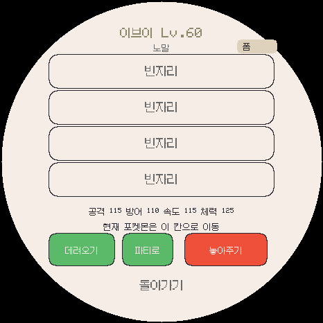
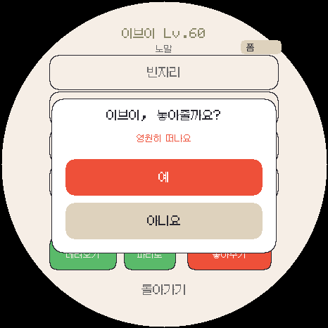
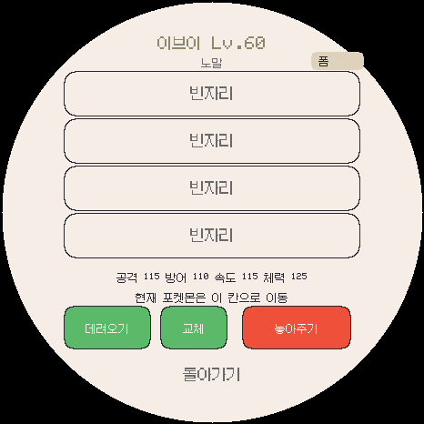

# 3.0.1 박스 직접 놓아주기 검증

파티 교체 선택이 남아 있으면 박스의 점유 칸을 누를 때 즉시 교체하던 경로를 수정했습니다. 점유 칸은 언제나 상세창을 열고, 가운데 버튼으로 교체를 확정합니다. 빈 칸으로의 보관과 현재 개체 맞교환은 유지합니다.

## 검사

- `box_direct`는 화면 최상위 입력 경로로 박스 열기 → 개체 상세 → 놓아주기 → 취소/확정을 검사합니다.
- 파티 5칸·박스 300칸이 가득 찬 경우, 파티 쪽 교체가 대기 중인 경우, 마지막 300번째 칸에서도 상세/놓아주기가 열리는지 확인합니다.
- 놓아주기 후 저장 재읽기, 현재 개체 보존, 하루 작별 횟수 미차감, 저장 실패 시 삭제 성공으로 표시하지 않는 것을 검사합니다.
- 기존 파티↔박스 교체, 빈 칸 보관, 페이지 이동, 상세/확인창의 스와이프 취소도 확인합니다.
- 전체 44개 런타임 검사 모음과 기존 SD 오류 검사 10개, 한국어/데이터/설치 페이지 검사로 회귀를 확인합니다. 실행 결과와 빌드/공개 파일 해시는 `build-results.json` 및 로그에 기록합니다.

## 화면

| 박스에서 직접 연 상세창 | 놓아주기 확인 | 교체 대기 중 상세창 |
|---|---|---|
|  |  |  |

화면은 실제 게임 그리기 코드와 테스트용 가상 저장을 사용했습니다. 실제 사용자 저장은 수정하지 않았습니다. Android·Wear OS·ESP 빌드와 서명/팩/해시 검증을 수행하며 실제 기기 설치·터치·무선·SD 전원 차단 시험은 별도로 필요합니다.
