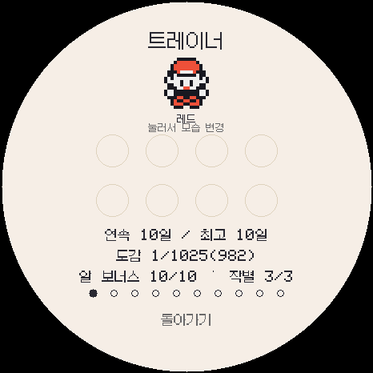
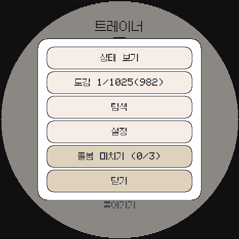
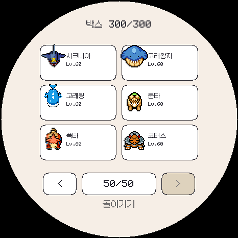
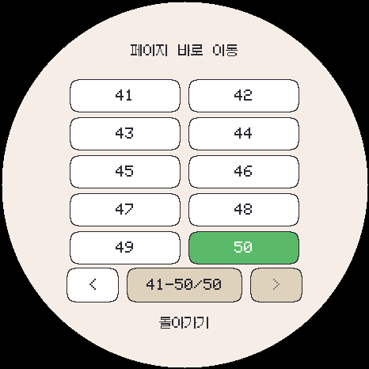

# 3.0.0-beta.6 비공개 검증

규칙과 조작법: [연속 돌봄·작별 제한·박스 이동](../../DAILY-REWARDS.ko.md).

**최종 결과: 42개 전체 런타임 검사·한국어/폰트 검사·4종 플랫폼 빌드 통과.**

## 검증 범위

- 일수 1~10의 가중치 증가, 10일 이후 상한, 돌봄 누락·날짜 역행·기준 시각 없는 경우.
- 실제 부화 각 5,000회: 1일차 이로치 98회, 10일차 473회. 통계 검사는 구현 연결 확인용이며 정확한 설계 확률은 정수 가중치로 별도 검사합니다.
- 좋은/일반 작별·현재 개체 보내기의 합산 3회, 네 번째 요청 거부, 현지 자정 경계, 재실행·전송 유지, NVS 기록 실패 시 작별 취소.
- 일반 최종진화 개체의 성장 1,440분/73레벨 좋은 작별과 파티가 가득 찼을 때 박스 보관 유지.
- 박스 이전·다음 버튼, 첫/마지막 경계, 50페이지 직접 선택, 선택창 취소와 스와이프, 이동 중 개체 무변경, 300번째 칸 교환.
- 한국어 문자열·폰트 검사 및 PC/Android/Wear/ESP 빌드. 전체 회귀 검사 결과는 `runtime-tests.log`, 파일 크기와 SHA-256은 `build-results.json`에 기록합니다.

## 화면

## 저장·배포 주의

세이브 v6는 v1~v5를 읽습니다. 포켓몬·기술 ID와 300칸 TFR3 구조는 바꾸지 않았습니다. 새 날짜별 횟수도 기기 간 전체 저장 전송에 포함됩니다. 구버전으로 새 저장을 되돌리는 것은 지원하지 않습니다. ESP의 보관 기록은 계속 SD 이중 스냅샷을 사용합니다.

Android versionCode 3010 / Wear 3011입니다. ESP 스케치 2,235,367바이트(71%), 전역 RAM 199,692바이트(60%), 앱 파일 2,235,520바이트입니다.

**공개 릴리스·실기 설치를 하지 않았습니다.** 실물 워치 터치, 기기별 자정·시간대 변경, 실제 무선 전송과 SD 전원 차단 동작은 별도 실기 검증이 필요합니다. 테스트는 독립된 메모리 저장을 사용하며 사용자의 실제 세이브를 열지 않았습니다.

재현: `tools/record_daily_rewards_qa.py`는 최종 검사 로그와 네 플랫폼 산출물을 확인한 뒤 기록을 생성합니다. 다음 정식 릴리스에는 규칙과 박스 조작법을 플레이 가이드 PDF에 반영해야 합니다.
