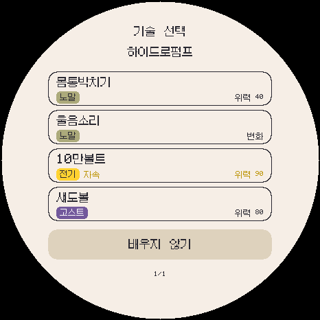
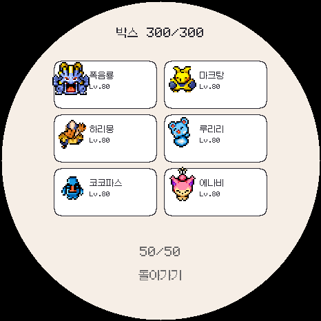

# 3.0.0-beta.5 로컬 검증

정식 릴리스/Pages 업로드·실제 기기 설치는 하지 않았습니다. 사용법과 제한은 [폼 기술·300칸 박스 안내](../../FORM-MOVES-BOX.ko.md)를 확인하세요.

- 39개 런타임 회귀 검사 및 최종 폼 기술/활성 교체/페이지 선택 검사.
- 300마리 세이브 내보내기·통신·복원, 256번째/300번째 슬롯, TFR1/TFR2 이전 및 교체 중단 복구.
- 폼 변경 후 기존 네 기술 유지, 직접 고른 칸만 교체, 거절·재습득, 박스 300번째 개체의 폼 기술 선택.
- 로토무/우라오스/큐레무/가라르 야도란 기술 목록, 69개 별도 목록, 수류연타 3회 급소와 셸암즈 물리/특수 선택.
- ESP SD 저장 경로의 카드 분리·짧은 쓰기·내부 선택 표식 실패·손상·초기화 10개 모의 검사. **실물 SD의 전원 차단 내구성은 미검증입니다.**
- 원래 695개 기술의 저장 번호 유지, 22개 추가. 글꼴/한국어 검사와 기존 176개 애니메이션 폼 데이터 검증.
- Windows 에뮬레이터, Android ARM64/x86_64, Wear OS ARM32/ARM64, ESP32-S3 빌드. APK ZIP·서명·정렬 및 포함 폼 팩 확인.

`build-results.json`에는 로컬 빌드 파일과 소스의 SHA-256이 있습니다. 생성 명령은 `tools/record_form_moves_qa.py`입니다. 에뮬레이터 화면 두 장은 실제 게임 코드의 버퍼에서 생성해 확인했습니다.

최종 ESP 앱은 2,233,040바이트이며 스케치 2,232,895바이트(70%), 전역 RAM 199,692바이트(60%)입니다. 사용 빈도가 낮은 직렬 내보내기 버퍼를 필요할 때 할당해 상시 RAM 32KB를 줄였습니다. Android versionCode 3008, Wear 3009입니다.

