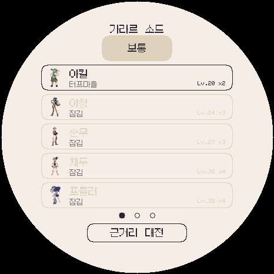
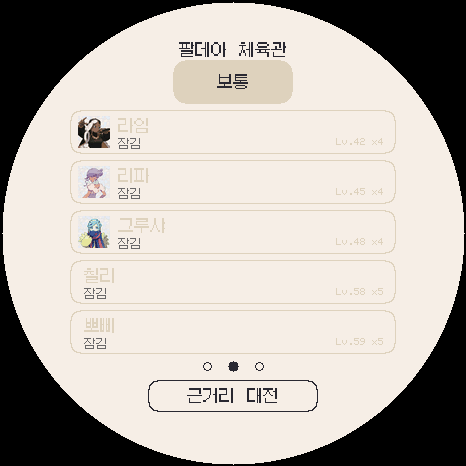
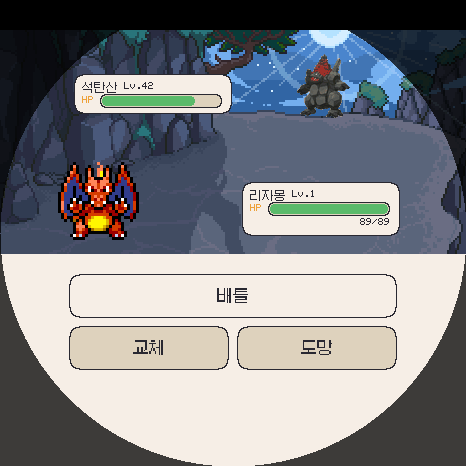
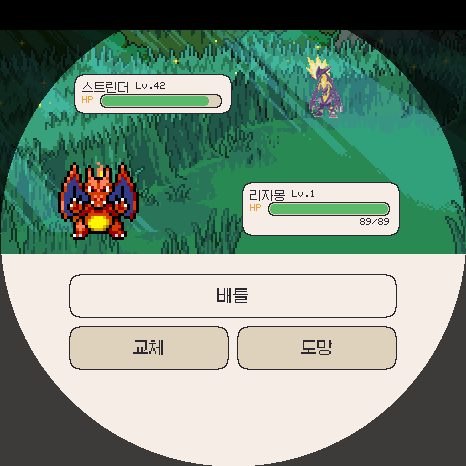

# 가라르·팔데아 체육관 검증

작업 버전: **3.0.0-beta.2**, 브랜치 `codex/persistent-forms`. 정식 2.0.2는 변경하지 않았으며 커밋·원격 업로드·실제 기기 설치는 하지 않았습니다. 이전 폼 베타 기능은 유지합니다.

## 자동 검사

- 전체 런타임 37개: 기존 35개에 `roster`, `gyms_new`를 추가했습니다. 최종 결과는 `runtime-tests-final.log`에 있습니다.
- 모든 지역의 관장·사천왕·챔피언이 자신의 지역 팀으로 시작하는 기존 회귀 검사를 9개 지역에 적용했습니다.
- 가라르 소드·실드 및 팔데아의 **39개 대전, 포켓몬 160마리**를 실제 화면 입력→공격→교체→승리 처리로 검사했습니다. 전투 중 메뉴 지방·코스 값을 바꿔도 상대와 승리 기록이 바뀌지 않습니다. 이 검사는 승리 처리의 기능 검사이지 자연스러운 난이도 밸런스 측정은 아닙니다.
- 기존 7개 지방 세이브의 짧은 배지 배열 두 개를 모두 보존하고 새 두 지역은 빈 기록으로 시작하는지 확인했습니다.
- 소드·실드 고유 관장의 승리 분리, 최상위 비트 15의 저장/재로드, 새 두 지역의 전체 내보내기→가져오기 복원을 검사했습니다.
- 상대 가라르 폼의 ID·레벨·실제 폼 데이터 연결, 파칙파칙스타일 춤추새의 전기 자속과 방어 상성, 모든 상대 종의 표시 수단을 검사했습니다.
- 공식 이미지 24개는 원본 SHA-256과 생성한 그림 테이블을 오프라인 대조했습니다. 기존 폼 그림 350개는 실제 그림 해석기로 다시 읽었습니다.
- 한국어 문자열·글꼴, 페이지 전환과 터치 영역 검사 통과. 최종 위치 조정 후 `gyms_new`, `roster`, `forms_ui`도 재실행했습니다.

## 로컬 빌드

PC 에뮬레이터, Android APK, Wear OS APK, ESP32-S3 펌웨어를 만들었습니다. 파일 크기와 SHA-256, 코드 파일별 SHA-256은 `build-results.json`에 있습니다. APK의 폼 팩은 현재 `web/forms.pak`와 동일한지도 대조했습니다.

- Android: arm64-v8a·x86_64, versionCode 3002.
- Wear OS: armeabi-v7a·arm64-v8a, versionCode 3003.
- APK는 기존 테스트 서명 유지 및 16KB 정렬 검사 통과. 실제 워치/휴대폰 설치 테스트는 별도입니다.
- ESP32: 3MB 앱 영역과 전역 RAM 한도 안에서 컴파일 통과. 최종 사용량은 `esp-compile.log`를 확인하세요. 실제 ESP32 LAN 배틀과 화면 검사는 별도입니다.
- PC 확인용 에뮬레이터는 별도 폼 베타 세이브를 사용하며, 새 세이브일 때만 기존 폼 테스트용 레벨80 여섯 마리를 준비합니다. 기존 파일을 지정해 불러오면 테스트 포켓몬을 덮어 넣지 않습니다.

## 화면 확인

466×466 실제 공용 그리기 코드의 출력입니다. 원형 화면의 명단·이름 배치와 정지 그림 위치를 눈으로 확인했습니다.

| 가라르 | 팔데아 |
|---|---|
|  |  |

| 석탄산의 전투용 정지 그림 | 라임의 로우한 모습 스트린더 |
|---|---|
|  |  |

## 한계

원작 팀·레벨과 공식 이미지에 기반한 콘텐츠 추가입니다. 원작의 테라스탈·자동 다이맥스·더블배틀·특성·개별 고정 기술까지 이식한 것은 아닙니다. 상세한 적용 범위와 자료 출처는 [체육관 안내](../../GYMS-GALAR-PALDEA.ko.md)를 참고하세요. 실제 기기에서 플레이했다고 주장하지 않습니다.
