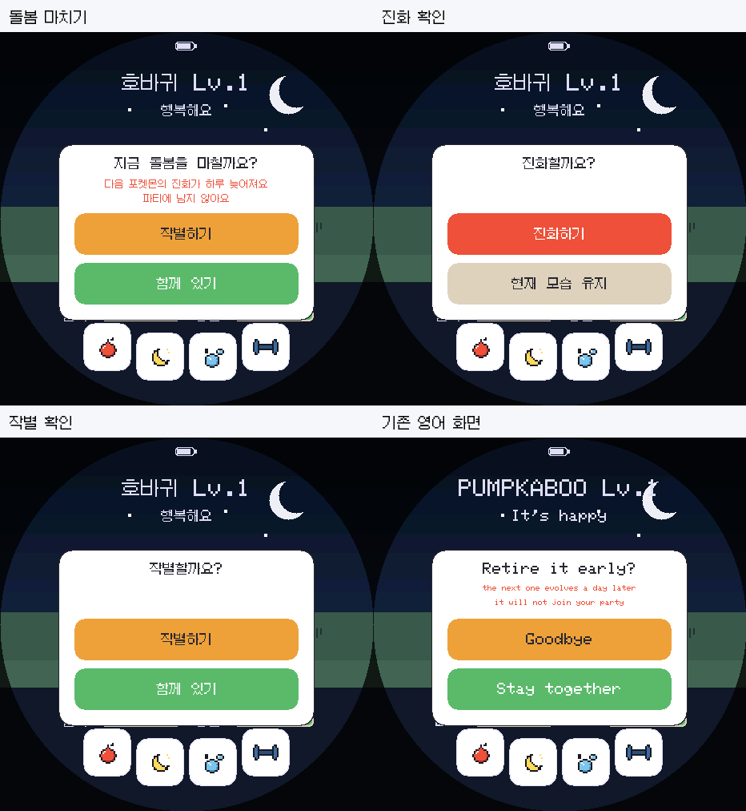

# ko.1.0.1 확인창 수정 검증

2026-09-03. DylanPDao/TamaPoke 기반, 809종·7개 지방 유지.

확인창 제목이 첫 안내문과 겹치고 두 번째 안내문이 버튼에 가려지는 문제를 수정했습니다. 패널을 위로 넓히고 제목·안내문·버튼 사이에 간격을 확보했습니다. 표시와 클릭 영역은 같은 상수를 사용합니다.

실제 펌웨어를 공유하는 Windows 에뮬레이터에서 생성한 화면입니다. 예시 포켓몬은 호바귀(710)이며 사용자 세이브를 사용하지 않았습니다.

- 실제 ESP32-S3 빌드 성공: 프로그램 1,849,943 B, 전역 RAM 66,884 B, 앱 파일 1,850,096 B.
- 한국어 글꼴·문자열·이름 검사 통과.
- 한국어 버전 검사 및 7개 팩·전송 응답·오류 처리 검사 통과.
- Korean / i18n / label / save / upgrade / link / hit / release 실행 검사 통과. 실제 확인 버튼 좌표에서 취소와 방출 동작 확인.
- 설치 manifest의 네 구간은 NVS와 FFat 저장 영역을 침범하지 않습니다.
- 펌웨어 크기와 SHA-256: [build-info.json](build-info.json).

실기 화면, 터치, 전원, SD, 소리, 무선 대전은 아직 확인하지 않았습니다.
