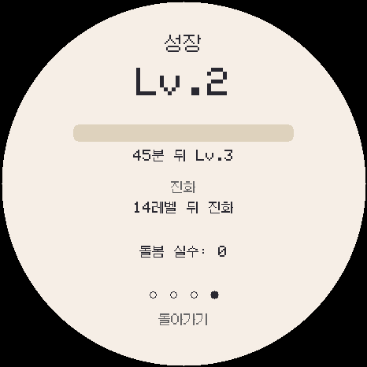
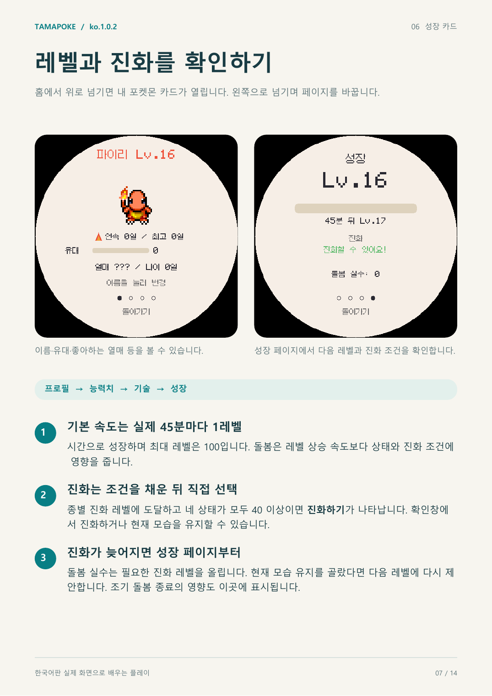

# ko.1.0.2 성장·수면 밸런스 검증

2026-09-04. DylanPDao/TamaPoke 기반, 809종·7개 지방 유지.

성장 속도를 실제 45분마다 1레벨로 조정하고, 수면 중 활력 회복을 분당 +10으로 높였습니다. 실시간 진행과 전원이 꺼져 있던 시간 계산에 같은 회복량을 적용했습니다.

실제 펌웨어 소스를 공유하는 Windows 에뮬레이터에서 레벨 2 직후의 성장 화면을 만들었습니다. 다음 레벨까지 45분으로 표시됩니다.

- 실제 ESP32-S3 빌드 성공: 프로그램 1,849,991 B, 전역 RAM 66,884 B, 앱 파일 1,850,144 B.
- 44분에는 레벨 1, 45분에는 레벨 2, 3일 2시간 15분에는 레벨 100임을 실제 `Pet` 코드로 확인했습니다.
- 실시간 수면 1분에 활력 +10, 오프라인 수면 2분에 활력 +20을 확인했습니다.
- 조기 돌봄 종료의 진화 지연은 32레벨로 환산되어 실제 하루를 유지합니다.
- 한국어 글꼴·문자열·이름·표시 폭, 세이브, 구버전 업그레이드, 통신, 버튼과 방출 회귀 검사를 통과했습니다.
- 한국어 플레이 설명서 14쪽을 ko.1.0.2 화면으로 다시 만들고 전체 페이지를 렌더링해 확인했습니다.
- 설치 manifest의 네 구간은 NVS와 FFat 저장 영역을 침범하지 않습니다.
- 밸런스 검사 기록: [balance-check.txt](balance-check.txt). 펌웨어 크기와 SHA-256: [build-info.json](build-info.json).

실기 화면, 터치, 전원, SD, 소리, 무선 대전은 아직 확인하지 않았습니다.
