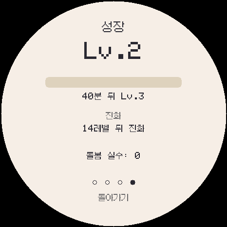
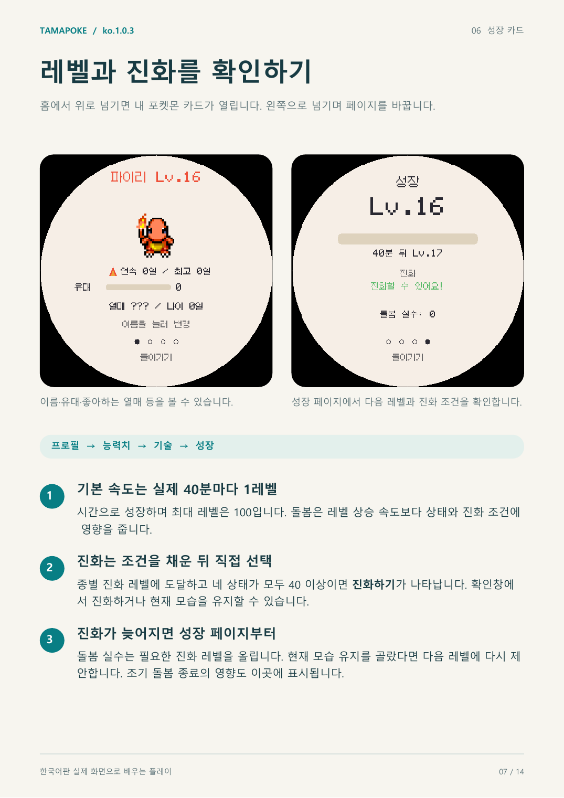
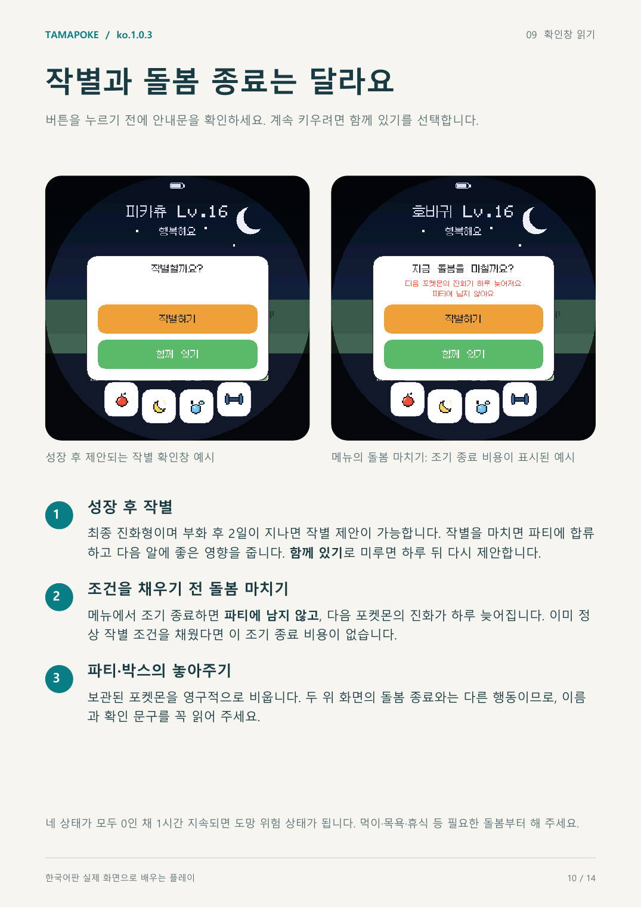

# ko.1.0.3 2일 작별 주기 검증

2026-09-04. DylanPDao/TamaPoke 기반, 809종·7개 지방 유지.

한 생애의 작별 제안 시점을 3일에서 2일로 줄이고, 그 주기에 맞춰 성장 속도를 실제 40분마다 1레벨로 조정했습니다. ko.1.0.2에서 높인 수면 중 활력 회복은 분당 +10으로 유지합니다.

실제 펌웨어 소스를 공유하는 Windows 에뮬레이터에서 레벨 2 직후의 성장 화면을 만들었습니다. 다음 레벨까지 40분으로 표시됩니다.

- 실제 ESP32-S3 빌드 성공: 프로그램 1,849,923 B, 전역 RAM 66,884 B, 앱 파일 1,850,064 B.
- 39분에는 레벨 1, 40분에는 레벨 2, 2일 18시간에는 레벨 100임을 실제 `Pet` 코드로 확인했습니다.
- 최종 진화 상태에서 2일 1분 전에는 작별이 잠겨 있고, 정확히 2일째 레벨 73에서 작별이 열립니다.
- 실시간 수면 1분에 활력 +10, 오프라인 수면 2분에 활력 +20을 확인했습니다.
- 조기 돌봄 종료의 진화 지연은 36레벨로 환산되어 실제 하루를 유지합니다.
- 한국어 글꼴·문자열·이름·표시 폭, 세이브, 구버전 업그레이드, 통신, 버튼과 방출 회귀 검사를 통과했습니다.
- 한국어 플레이 설명서 14쪽을 ko.1.0.3 화면으로 다시 만들고 전체 페이지를 렌더링해 확인했습니다.
- 설치 manifest의 네 구간은 NVS와 FFat 저장 영역을 침범하지 않습니다.
- 밸런스 검사 기록: [balance-check.txt](balance-check.txt). 펌웨어 크기와 SHA-256: [build-info.json](build-info.json).

실기 화면, 터치, 전원, SD, 소리, 무선 대전은 아직 확인하지 않았습니다.
