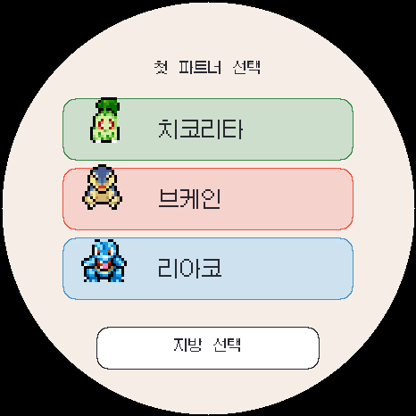

# ko.1.0.5 첫 파트너 지역 재선택 검증

첫 파트너 후보를 확인한 뒤 다른 지방의 스타팅 포켓몬과 비교할 수 있도록 후보 목록 아래에 **지방 선택** 버튼을 추가했습니다.

## 확인 결과

- 성도 후보 확인 → 지방 선택 → 관동 후보 확인 → 지방 선택 → 성도 재선택 → 브케인 확정 흐름 통과
- 지역을 다시 고르는 동안 첫 파트너가 확정되지 않으며, 최종 선택한 지방과 포켓몬이 저장됨
- 버튼 높이 48픽셀로 최소 터치 높이 44픽셀 충족
- 마지막 스타팅 포켓몬 행과 버튼 영역이 겹치지 않음
- 466×466 에뮬레이터 화면에서 글자와 버튼이 원형 표시 영역 안에 들어옴
- 한국어·세이브·업그레이드·통신·밸런스·809종 기술·터치·첫 파트너·놓아주기 회귀 검사 통과
- ESP32-S3 펌웨어 빌드 성공: 앱 1,850,384바이트, 프로그램 영역 58%, 전역 RAM 66,884바이트
- 설치 이미지의 NVS 및 FFat 보존 범위 검사 통과

빌드 세부 정보와 각 파일의 SHA-256은 [build-info.json](build-info.json)에 기록했습니다.
