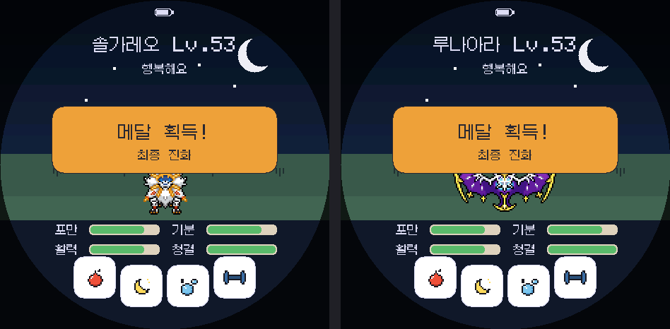

# ko.1.0.6 분기 진화 검증

ko.1.0.6은 1~809번 범위의 다중 결과 진화 12가족을 이브이와 같은 공통 규칙으로 처리합니다. 현재 도감에 없는 진화 경로를 먼저 선택하고, 해당 가족의 모든 경로를 수집한 뒤에는 가능한 결과 중 하나를 무작위로 선택합니다.

## 적용 대상

- 냄새꼬 → 라플레시아 / 아르코
- 슈륙챙이 → 강챙이 / 왕구리
- 야돈 → 야도란 / 야도킹
- 이브이 → 샤미드 / 쥬피썬더 / 부스터 / 에브이 / 블래키 / 리피아 / 글레이시아 / 님피아
- 배루키 → 시라소몬 / 홍수몬 / 카포에라
- 개무소 → 실쿤 / 카스쿤
- 킬리아 → 가디안 / 엘레이드
- 토중몬 → 아이스크 / 껍질몬
- 눈꼬마 → 얼음귀신 / 눈여아
- 진주몽 → 헌테일 / 분홍장이
- 도롱충이 → 도롱마담 / 나메일
- 코스모움 → 솔가레오 / 루나아라

## 확인 결과

- 생성 데이터의 12가족과 모든 목표 번호가 예상값과 일치합니다.
- 모든 분기 결과를 진화 전용 희귀도로 처리해 알에서 직접 나오지 않습니다.
- 각 가족에서 한쪽 경로만 미등록일 때 그 경로를 우선 선택합니다.
- 개무소는 실쿤·카스쿤뿐 아니라 뷰티플라이·독케일까지 확인해 미등록 최종 경로를 선택합니다.
- 코스모움은 솔가레오 미등록 상태와 루나아라 미등록 상태를 각각 재현해 양쪽 결과를 확인했습니다.
- 설치된 지방 팩과 그림 파일을 확인해 실제로 표시할 수 있는 결과만 후보로 사용합니다.
- 포켓몬 번호, 세이브 구조와 무선 통신 기록 형식은 변경하지 않았습니다.
- 한국어·이름·표시 폭·세이브·업그레이드·통신·밸런스·기술·809종 도감·스타터·릴리스 회귀 검사를 통과했습니다.
- Windows 일반판, 비공개 도감 완성판, 비공개 전체 이로치판을 각각 빌드했습니다. 비공개 두 판은 GitHub 릴리스와 설치 페이지에 포함하지 않습니다.
- ESP32-S3 스케치 1,850,435바이트(58%), 앱 파일 1,850,576바이트, 전역 RAM 66,884바이트(20%)입니다.
- 설치 펌웨어가 NVS와 FFat 세이브 영역을 침범하지 않는지 검사했습니다.

실기 화면·터치·전원·SD·소리·무선 대전은 아직 확인하지 않았습니다.
