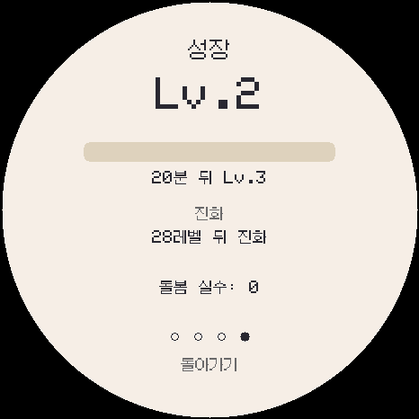

# ko.1.1.0 성장·수면·조기 종료 조정 검증

`ko.1.1.0`은 `ko.1.1.0a`의 전국도감 1025종과 9개 지방을 유지하면서 육성 속도와 수면 회복, 조기 돌봄 종료 규칙을 조정한 정식 빌드입니다.

## 변경 사항

- 성장 속도를 40분당 1레벨에서 **20분당 1레벨**로 변경했습니다.
- 레벨 100 도달 시간은 2일 18시간에서 **1일 9시간**으로 줄었습니다.
- 수면 중 활력 회복을 실시간·오프라인 모두 분당 10에서 **분당 15**로 높였습니다.
- 조기 돌봄 종료가 다음 포켓몬의 진화를 하루 늦추던 페널티를 제거했습니다.
- 이전 버전 저장에 남은 진화 지연 값은 불러오는 즉시 0으로 바꾸고 NVS에도 다시 저장합니다.
- 조기 종료한 포켓몬이 파티에 남지 않고 다음 알에 작별 보너스를 주지 않는 규칙은 유지합니다.

## 검사 결과

- 성장 경계: 19분에는 레벨 1, 20분에는 레벨 2, 1일 9시간에는 레벨 100임을 실제 `Pet` 코드로 확인했습니다.
- 수면 회복: 실시간 1분에 활력 20→35, 오프라인 2분에 활력 20→50을 확인했습니다.
- 조기 종료: 다음 포켓몬이 원래 진화 시점 1분 전에는 진화하지 않고, 정확한 시점에는 진화하는 것을 확인했습니다.
- 저장 이전: 기존 `evop=36` 값을 가진 저장을 불러오면 메모리와 NVS 모두 0으로 정리되는 것을 확인했습니다.
- 18개 실행 회귀 검사: 한국어, 저장·업그레이드, 통신, 밸런스, 조기 종료, 1025종 기술·도감, 분기 진화, 9개 지역, 전체 도감/이로치 테스트판, 터치·스타터·놓아주기 통과.
- Windows 일반·도감 완성·전체 이로치 에뮬레이터가 각각 `ko.1.1.0`, `ko.1.1.0-dex`, `ko.1.1.0-shiny`로 부팅하고 스프라이트 1025종을 읽었습니다.
- 웹 설치 페이지의 9개 TPAK 팩, 버전 검사, 전송 오류 처리와 NVS 보존 범위 검사를 통과했습니다.
- ESP32-S3 펌웨어: 프로그램 1,885,123바이트(59%), 전역 RAM 66,940바이트(20%), 앱 파일 1,885,264바이트.
- Android Full 디버그 APK: `ko.1.1.0-android.1`, versionCode 1102, 301,274,342바이트. ARM64/x86_64와 9개 지역 팩을 포함하며 ZIP CRC, 16KB 페이지 정렬, v2/v3 서명, 패키지/버전, 네이티브 진입점 및 현재 버전 문자열을 확인했습니다.
- 연결된 Android 기기는 USB 디버깅 미승인 상태여서 실제 설치·실행은 확인하지 않았습니다. 이전 APK는 다른 디버그 키로 서명되어 덮어쓸 수 없습니다. 기존 앱 삭제 시 Android 저장 데이터도 지워지므로 저장이 중요하면 원래 키스토어로 서명해야 합니다.

펌웨어 파일 크기와 SHA-256은 [build-info.json](build-info.json), Android APK 정보는 [android-build-info.json](android-build-info.json)에 있습니다. 실기 화면·터치·전원·SD·소리·무선 대전은 아직 확인하지 않았습니다.
