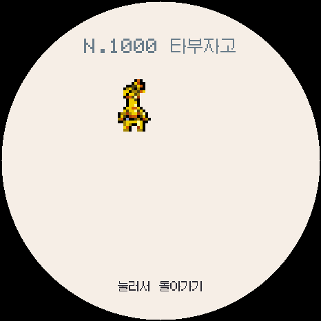

# ko.1.1.0a 가라르·팔데아 도감 확장 검증

`ko.1.1.0a`는 전국도감 #810~#1025를 추가해 총 1025종을 지원합니다. 도감과 알 지역은 가라르·팔데아를 포함한 9지역이며, 체육관은 기존 관동~알로라 7지역 그대로입니다.

## 데이터와 진화

- 한국어 포켓몬 위키에서 전국도감 번호, 공식 한국어 이름, 타입, 종족값과 레벨업 기술을 확인해 216종과 추가 기술 45개를 연결했습니다.
- 기존 포켓몬에서 가라르·히스이·팔데아 진화체로 이어지는 계보와 과사삭벌레·카르본의 분기 진화를 기존 이브이식 수집 규칙으로 처리했습니다.
- 1025종 전체의 이름, 타입, 6개 능력치, 진화 대상, 기술 번호와 한국어 글꼴 포함 여부를 검사했습니다.
- `전체` 알 지역은 고정 크기 후보 목록 대신 균등 추출을 사용해, 뒷번호 포켓몬도 앞번호와 같은 조건으로 후보가 됩니다.

## 스프라이트와 알 출현 제한

- PMDCollab에서 정상 표시 가능한 일반 스프라이트 977종을 포장했습니다.
- 사용할 수 있는 기본 스프라이트가 없는 48종은 도감 번호를 유지하되 알에서 나오지 않습니다.
- 그 48종으로 진화할 수 있는 앞 단계까지 포함한 총 64종을 알 후보에서 제외했습니다.
- 가라르 팩은 일반 스프라이트 87종, 팔데아 팩은 100종을 포함합니다. 이로치 자료가 없고 일반 자료가 있는 종은 일반 그림으로 대체 표시합니다.
- 종별 제작자와 라이선스는 [가라르·팔데아 출처표](../../PMDCOLLAB_GALAR_PALDEA_CREDITS.md)에 기록했습니다.

## 검사 결과

- 17개 실행 회귀 검사: 한국어, 저장·업그레이드, 통신, 밸런스, 1025종 기술·도감, 19개 분기 진화, 9개 지역, 전체 도감/이로치 테스트판, 터치·스타터·놓아주기 통과.
- 9개 지역과 모든 희귀도에서 12,000회 알 추첨: 제외 대상 0건, 지역 변경 시 희귀도 유지 360/360회.
- 977개 스프라이트 실파일 로드: 요청 번호와 다른 그림을 연 파일 0건. #1000처럼 네 자리 번호도 정상 로드.
- Windows 일반·도감 완성·전체 이로치 에뮬레이터 빌드 통과. 도감 #1000 타부자고의 한국어 이름과 애니메이션을 466×466 화면에서 확인했습니다.
- 웹 설치 페이지의 9개 TPAK 팩, 버전 검사, 전송 오류 처리와 NVS 보존 범위 검사 통과.
- ESP32-S3 펌웨어: 프로그램 1,885,195바이트(59%), 전역 RAM 66,940바이트(20%), 앱 파일 1,885,344바이트.

세부 파일 크기와 해시는 [build-info.json](build-info.json), 스프라이트 제외 목록과 팩 크기는 [sprite-coverage.json](sprite-coverage.json)에 있습니다. 실기 화면·터치·전원·SD·소리·무선 대전은 아직 확인하지 않았습니다.
