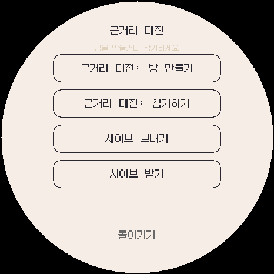
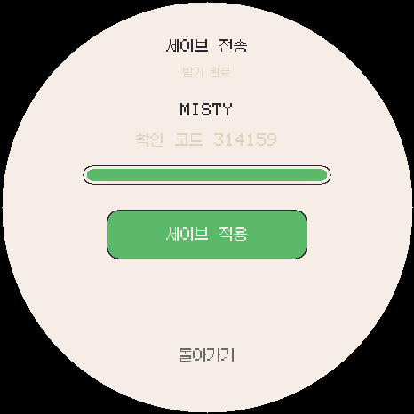
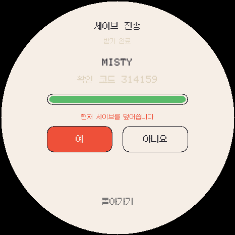

# ko.1.1.2 세이브 전송 검증

`ko.1.1.2`는 Android, Wear OS, ESP32-S3가 동일한 Link 프로토콜로 전체 세이브를 주고받는 기능을 추가합니다.

## 설계

- 기존 LAN 대전의 ESP-NOW 및 UDP 발견·전송 계층을 함께 사용합니다.
- 최대 2,048바이트 세이브를 192바이트 조각으로 나눠 한 조각씩 요청·응답합니다.
- 응답이 사라지면 보관한 요청 또는 조각을 재전송하고, 연결 대기에는 90초 제한을 둡니다.
- 발신·수신 역할이 서로 다를 때만 연결하고 양쪽에 같은 6자리 확인 코드를 표시합니다.
- 수신 데이터는 전체 길이, 저장 형식, 필드 구조와 CRC16이 모두 맞아야 `세이브 적용` 상태가 됩니다.
- 수신만으로는 NVS를 수정하지 않습니다. 사용자가 `세이브 적용 → 예`를 누를 때만 현재 저장을 교체하고 재시작합니다.

## 자동 확인

- 1,200바이트가 넘는 대표 세이브의 다중 조각 전송과 바이트 일치를 확인했습니다.
- 매 3번째·4번째 패킷을 주기적으로 버리는 양방향 손실 환경에서도 재전송 후 완료됐습니다.
- 손상된 발신 세이브를 라디오 사용 전에 거부하고, 보내기↔보내기 조합을 거부했습니다.
- 수신 완료 전후에 대상 NVS가 바뀌지 않고, 명시적 적용 뒤에만 원본 트레이너 데이터로 교체되는 것을 확인했습니다.
- 기존 세이브 복원, 업그레이드, LAN 대전, UDP 봉투, 전체 도감, UI 터치 등 21개 런타임 묶음이 통과했습니다.
- 7개 언어 184개 문자열과 700개 한글 글리프를 확인했습니다.
- 원형 466×466 메뉴, 수신 완료, 덮어쓰기 확인 화면을 렌더링해 버튼·문구가 안전 영역 안에 있는 것을 확인했습니다.

## 빌드 결과

- ESP32-S3 앱: 1,902,223바이트(60%), 전역 RAM 74,028바이트(22%), 배포 `app.bin` 1,902,368바이트.
- Android Full: `ko.1.1.2-android.1`, versionCode 1112, ARM64/x86_64, 301,290,726바이트, APK v2/v3 서명 확인.
- Wear OS Watch4~9: `ko.1.1.2-wear.1`, versionCode 1113, armeabi-v7a/arm64-v8a, 301,016,299바이트, APK v3 서명 확인.
- ESP32 설치 ZIP: 2,082,851바이트. 네 분할 펌웨어와 통합 신규 설치 이미지, manifest, 빌드 해시를 포함합니다.
- 설치·세이브 전송 PDF: 8쪽, 160,209바이트. 전체 페이지 렌더링과 핵심 문구 추출을 확인했습니다.
- 웹 설치 manifest는 NVS `0x009000..0x00E000`과 FFat `0x610000..0xFF0000`을 침범하지 않습니다.
- 비공개 `ko.1.1.2-dex`, `ko.1.1.2-shiny` 에뮬레이터를 각각 빌드·실행했으며 공개 릴리즈에는 넣지 않습니다.

## 아직 확인하지 못한 내용

연결 가능한 Android, Galaxy Watch4~9와 ESP32 실기가 동시에 없어 실제 조합별 세이브 송수신·적용은 아직 확인하지 못했습니다. 자동 테스트와 빌드 성공을 실기 성공으로 기록하지 않습니다. [실기 체크리스트](../../HARDWARE_TEST.ko.md)의 세이브 전송 항목으로 확인해야 합니다.
